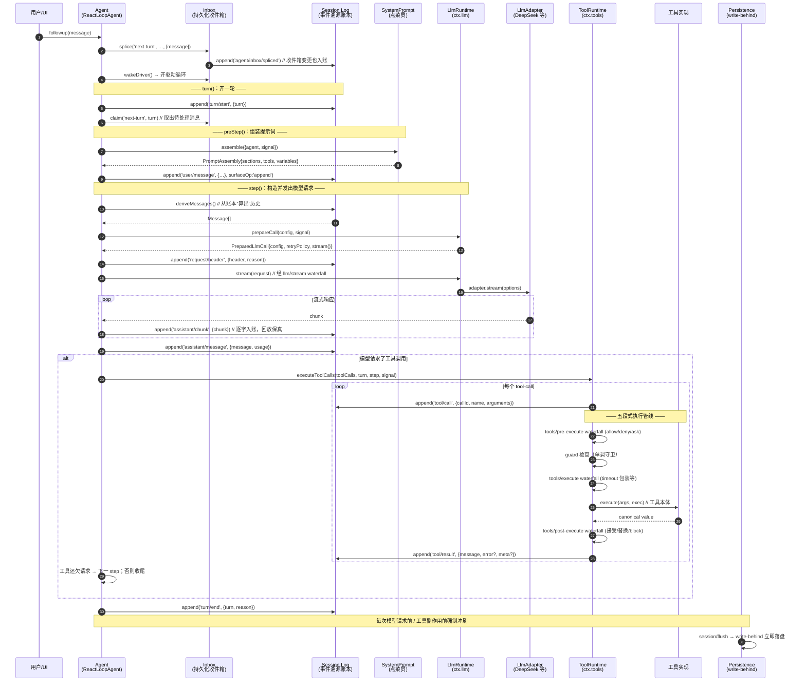
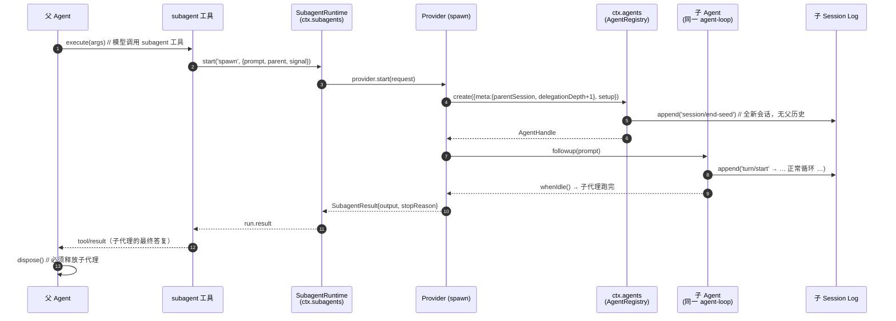
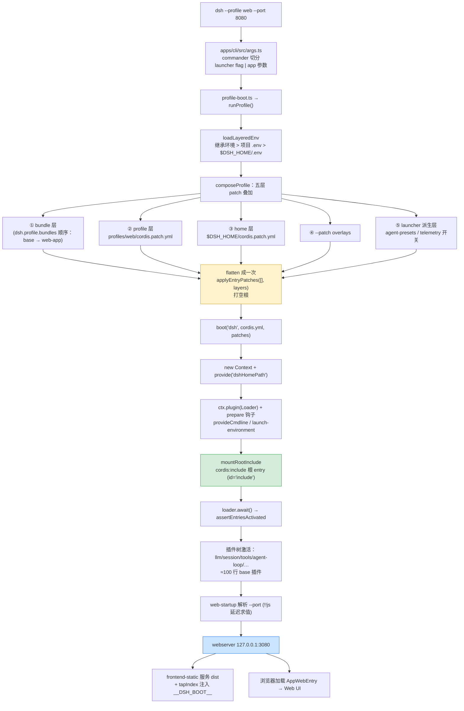
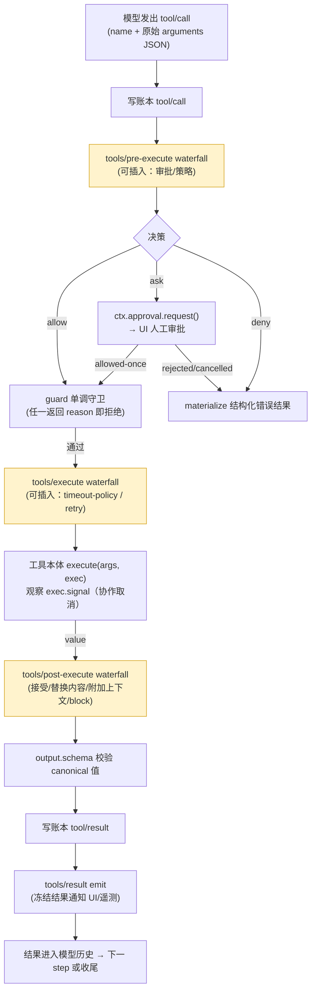
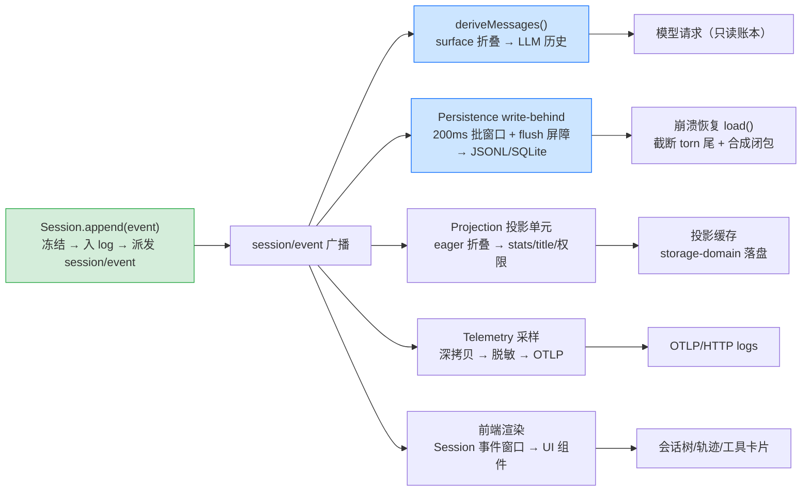
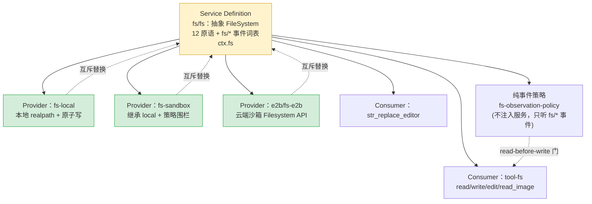

# DeepSeek Harness 底层原理图解（时序图 + 流程图）

> 基于 `deepseek-harness-master` 源码精读。所有图均为 Mermaid 语法，可直接在 GitHub / Typora / 支持 Mermaid 的编辑器渲染。
> 图例：参与者即真实模块；消息即真实方法/事件名（与源码一致）。

---

## 图 1（时序图）：一次对话 turn 的完整旅程 —— 从输入到落盘

这是全系统最核心的一条链路：`ReactLoopAgent.turn()/step()` 驱动一轮对话。

**关键点**：
- 编号 3、5、10、15、19、24 都是**写账本**——"模型可见 ⟺ 已记录"铁律的体现；
- `request/header` 是"请求快照"（provider/model/工具列表），模型历史完全由 `deriveMessages()` 从账本折叠出来；
- `assistant/chunk` 逐字入账，保证 UI 重放与真实输出一字不差；
- 工具结果按模型顺序提交（结果保序、执行可重叠），取消时为未启动的调用补写合成结果。

---

## 图 2（时序图）：子代理委派 —— 一个 Agent 生出一个 Agent

前台一次性委派（`subagent` 工具 → `spawn` provider 的完整时序）。

**关键点**：
- 子代理**复用同一条 agent-loop**——`create()` 的 setup 钩子里装配 persona/工具过滤/结构化输出，发布时序与主 agent 完全一致；
- `parentSession` + `delegationDepth`（父深度+1）写入 SessionHeader，形成可持久化的血缘树；`fork` provider 则用父会话已完成前缀做 seed；
- 可续子代理（continuable）走 `startContinuable`：父用 `send_message` 续发、`interrupt_agent` 只停当前轮，冷恢复直接从持久化 Session + 折叠描述符重建，**不经过 Provider**。

---

## 图 3（流程图）：dsh 启动 —— 五层 patch 组合成插件树

从命令到运行中的 Web UI。

**关键点**：
- **一次 `applyEntryPatches`** 保证 `--dump-config`、flag 推导与真实 boot **同源不漂移**；
- patch 按 id **整段替换 config**（非深合并）、同 id 后写胜出；`insert` 行按引用推入结果树，故每代应用前必须 `structuredClone`；
- `!!js` YAML 方言在**该行声明的 injections 激活后**才求值——所以 `webserver` 行能直接读 `ctx.webStartup.port`，flag 永远压过写死的默认值。

---

## 图 4（流程图）：工具执行五段式管线

一次 `tool/call` 从模型到结果的全部阶段与可插入点。

**关键点**：
- `tools/pre-execute`（决策）、`tools/execute`（around 包装）、`tools/post-execute`（结果改写）是**三个 waterfall**——监听者必须 `next()` 委托，否则短路；
- 所有失败都归一化为结构化结果（`message + code`），模型可读可自纠（如 `UNKNOWN_TOOL`/`TOOL_TIMEOUT`/`FS_STALE_VERSION`）；
- `timeout-policy` 通过临时替换 `exec.signal` 实现协作式超时；审批 `ask` 只在工具调用挂起期间等真人。

---

## 图 5（流程图）：会话日志 —— 一本账，四家读

事件溯源生态：所有下游都从同一本账派生，彼此不共享可变状态。

**关键点**：
- 持久化、UI、遥测、投影**互不阻塞**——append 是同步入 log + fire-and-forget 通知；
- 压缩（compaction）通过 `surfaceOp:{op:'replace',start,end}` **盖纸条**遮蔽旧节点而非删除，`sourceEventSeqs` 保留可恢复性；
- SQLite 后端：每事件一行（`data` 为 JSON 原文），`SCHEMA_VERSION=15` + `application_id=0x44534850`，崩溃后 `load()` 找最后 `turn/end` 判撕裂点，自动补齐中断回合。

---

## 图 6（流程图）：能力接缝 —— 三脚插座的实例

以文件系统为例，展示 Definition / Provider / Consumer 如何让"换实现 = 换行为"。

**关键点**：
- 一个 context 只允许一个 Provider 实现（装载第二个报重复服务）；
- `fs-observation-policy` 不注册服务、只通过 `fs/write-intent`/`fs/edit-intent`/`fs/observed` 事件参与——卸载它只丢策略，工具仍可用裸 Provider（策略与能力正交组合）；
- 换 Provider（本地→沙箱→E2B）时，`tool-fs`、`bash-local`、`terminal-bash`、`lsp-stdio` 全部零改动——这就是"一套执行世界"。

---

*图源：`packages/core/{agent-loop,agent,session,tools}`、`packages/fs/*`、`packages/boot/app-boot`、`packages/subagent/*` 源码精读。*
